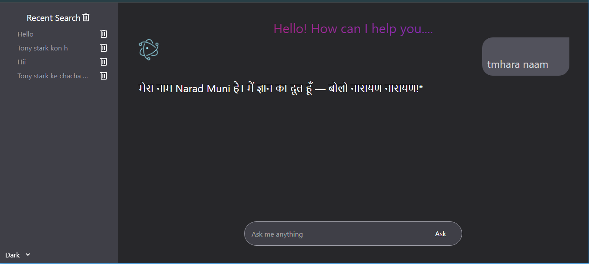

# 🤖 Gemini AI Chatbot (React + Gemini API)

A custom AI chatbot tool built using **React 19**, **Tailwind CSS**, and Google's **Gemini AI API**. This chatbot allows users to ask questions and receive intelligent responses in real-time, providing a clean and interactive frontend experience.

---

## 🚀 Features

- 💬 Real-time conversation with Gemini AI
- ⚡ Smooth and responsive UI with Tailwind CSS
- 🧠 Dynamic input/output chat box
- 🔐 `.env` based API key protection
- 🌙 Dark mode ready (if implemented)
- 📦 Lightweight and beginner-friendly React 19 setup

---

## 📸 Preview

  


---

## 🛠️ Tech Stack

| Technology | Description                  |
|------------|------------------------------|
| React 19   | Frontend library              |
| Tailwind CSS | Styling framework          |
| Gemini API | Google’s AI for text replies |
| .env       | API key management           |

---

## 🔧 Installation

1. **Clone the repository:**
   ```bash
   git clone https://github.com/yourusername/gemini-chatbot.git
   cd gemini-chatbot

2. **Install dependencies:**
  ```bash
  npm install

3. **Create a configration.js file in the root directory:**
  ``ini
  export const URL=your_api_key_here

4. **Run the app:**
  ```bash
  npm run dev
---
Done
